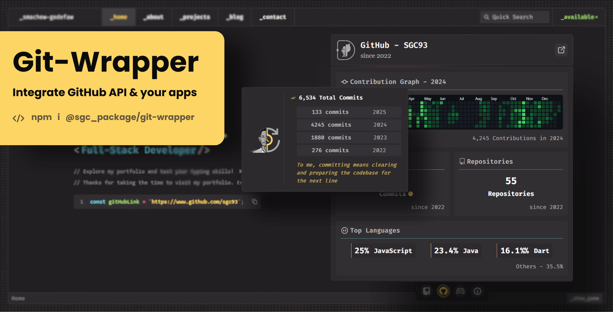

# Git Wrapper

Git Wrapper is a powerful Node.js package that provides an easy way to interact with the GitHub API. It wraps various endpoints and operations, enabling developers to access and summarize GitHub data with minimal effort. This package simplifies data retrieval and analysis from GitHub, making it an excellent choice for integrating GitHub functionalities into your applications.



## Features

- Fetch user profiles and organization data.
- Summarize commits, issues, repositories, pull requests, and languages used.
- Retrieve recent activities and statistics for a user.
- Modularized functions for easy integration into your project.

---

## Installation

Install the package using npm:

```bash
npm install @sgc_packages/git-wrapper
```

---

## Usage

The package provides two main ways to use it: **Wrapper Object** and **Direct Method Import.**

### 1. Wrapper Object

The `gitWrapped` function initializes the wrapper object with user profile data and provides access to various summarization methods. This approach is ideal if you need a centralized object to work with multiple GitHub functionalities.

```javascript
const { gitWrapped } = require('@sgc_packages/git-wrapper');

const gitToken = '******* YOUR PERSONAL ACCESS TOKEN - best for portfolio integration ********';

const userInfo = async () => {
  const wrapper = await gitWrapped('sgc93', gitToken);
  if (wrapper.success) {
    const profile = wrapper.profile;
    console.log(profile);

    const { commitSummerizer } = wrapper.methods;  // list of ll methods ...
    const response = await commitSummerizer(profile.username, gitToken, profile.created_at);
    if (response.success) {
      console.log(response.data.totalCommits);
      console.log(response.data.commitsPerYear);
    } else {
      console.log(response.error);
    }
  } else {
    console.log(wrapper.error);
  }
};

userInfo();
```

### 2. Direct Method Import

You can also directly import and use specific methods from the package. This approach is best if you only need certain functionalities without initializing the entire wrapper object.

```javascript
const { getUserProfile, commitSummerizer, repoSummerizer } = require('@sgc_packages/git-wrapper'); // list of all methods ...

const gitToken = '******* YOUR PERSONAL ACCESS TOKEN - best for portfolio integration ********';

const run = async () => {
  const profile = await getUserProfile('sgc93', gitToken);
  if (profile.success) {
    console.log(profile.data);

    const commits = await commitSummerizer(profile.data.username, gitToken, profile.data.created_at);
    console.log(commits.data);

    const repos = await repoSummerizer(profile.data.username, gitToken);
    console.log(repos.data);
  } else {
    console.log(profile.error);
  }
};

run();
```

---

## Methods

### `commitSummerizer(username, token, created_at)`

Summarizes commit data for a user.

- **Purpose**: Provides an overview of a user’s commit activity, useful for analytics and reporting.
- **Parameters**:
  - `username`: GitHub username.
  - `token`: Personal access token.
  - `created_at`: User account creation date.
- **Returns**: Total commits and commits per year (from the user's start till know).

### `getUserProfile(username, token)`

Fetches the GitHub user profile.

- **Purpose**: Retrieve detailed user information for display or further analysis.
- **Parameters**:
  - `username`: GitHub username.
  - `token`: Personal access token.
- **Returns**: User profile data including name, bio, repositories, gists, etc.

### `issueSummerizer(username, token)`

Summarizes issues created by the user.

- **Purpose**: Analyze issue contributions for project management or statistics.
- **Parameters**:
  - `username`: GitHub username.
  - `token`: Personal access token.
- **Returns**: Total number of issues and other details.

### `getOrgs(username, token)`

Fetches the organizations the user belongs to.

- **Purpose**: Identify collaborations and memberships for organizational insights.
- **Parameters**:
  - `username`: GitHub username.
  - `token`: Personal access token.
- **Returns**: Total number of organizations.

### `recentActivities(username, token)`

Retrieves recent activities of the user.

- **Purpose**: Track user activities such as commits, pull requests, and issue updates.
- **Parameters**:
  - `username`: GitHub username.
  - `token`: Personal access token.
- **Returns**: List of recent activities ( top 10 recents ) such as commits, PRs, and issues.

### `pullRequestSummerizer(username, token)`

Summarizes pull request data for the user.

- **Purpose**: Gain insights into pull request contributions and activity.
- **Parameters**:
  - `username`: GitHub username.
  - `token`: Personal access token.
- **Returns**: Total pull requests.

### `lngSummerizer(repos, token)`

Summarizes languages used across all repositories.

- **Purpose**: Determine language preferences and usage statistics.
- **Parameters**:
  - `repos`: list of repositories.
  - `token`: Personal access token.
- **Returns**: Language usage stats: top language, language coverage, langauge per repos, LOC, etc.

### `repoSummerizer(repos, token)`

Summarizes repository data for the user.

- **Purpose**: Analyze repository contributions and trends.
- **Parameters**:
  - `repos`: User Repositories.
  - `token`: Personal access token.
- **Returns**: Total repositories, popular repositores and more detailed stats.

### `getAllRepos(username, token)`

Fetches all repositories of the user.

- **Purpose**: List all repositories for further processing or display.
- **Parameters**:
  - `username`: GitHub username.
  - `token`: Personal access token.
- **Returns**: List of all repositories with details sorted by number of earned stars.

---

## Integration and Use Cases

Git Wrapper is designed to be seamlessly integrated into applications requiring GitHub data, such as:

- **Personal Portfolio**: detailed and visually apealing representaiton of github level coding experience.
- **Dashboards**: Build analytics dashboards showcasing user activities, language usage, and repository stats.
- **Developer Tools**: Enhance developer tools with GitHub insights like commit trends and pull request summaries.
- **Project Management Apps**: Use summarization methods to monitor issues, pull requests, and repository contributions.

With its modularized functions and wrapper object, Git Wrapper is flexible enough to fit various use cases and project architectures.

---

## Inspiration

This package is inspired by [git-wrapped.com](https://git-wrapped.com) and aims to bring similar capabilities to developers for programmatic GitHub API interaction.

---

## Contributing

We welcome contributions! Feel free to submit issues or create pull requests.

1. Fork the repository.
2. Create a new branch.
3. Make your changes.
4. Submit a pull request.

---

## License

This project is licensed under the MIT License. See the LICENSE file for details.

